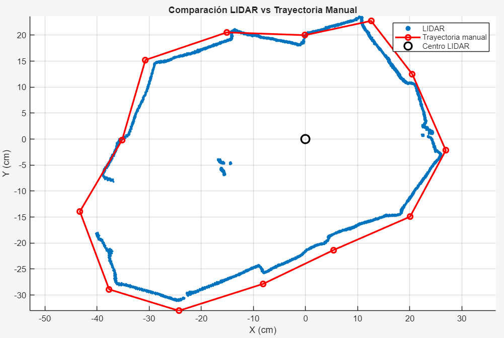
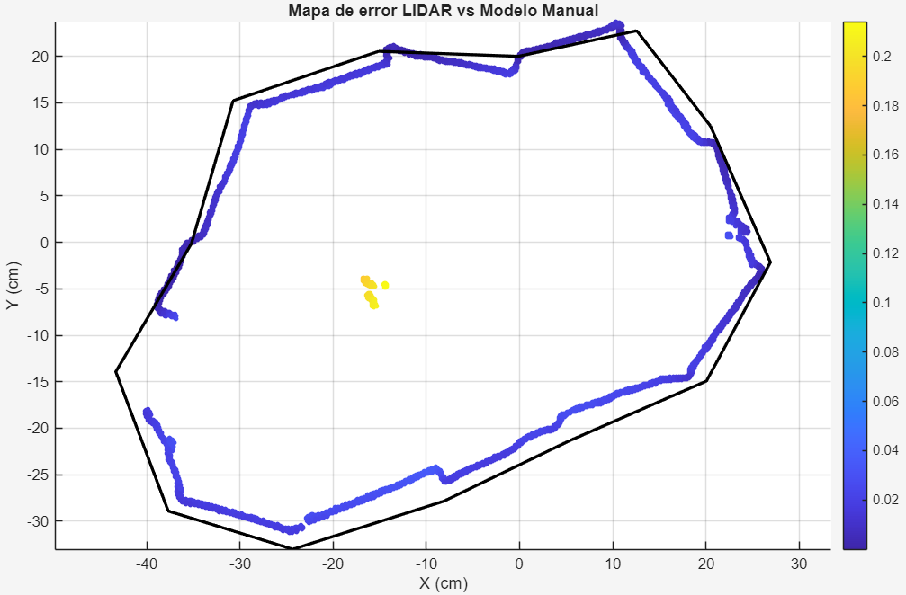

# Laboratorio 4 Sensores y SLAM:

# Parte 1: Manejo de Sensores y microcontroladores

 En la carpeta [Microcontrolador](Microcontrolador/) podemos encontrar el codigo en arduino para el uso de una imu **MPU6050** mediante ROS y comunicacion serial, este codigo se encarga de tomar las lecturas del sensor y enviarlas a un topico de ROS llamado **IMU_ROS**. Para ejecutarlo es necesario tener instalado el paquete **rosserial_arduino** en la carpeta del **lib** del workspace. Ademas de configurar el puerto com de la placa y cargar el codigo en el microcontrolador.

```bash
rosrun rosserial_arduino serial_node.py  _port:="/dev/ttyUSB0" _baud:="115200"
```
En otra terminal podemos ver las lecturas del sensor con:

```bash
rostopic echo /IMU_ROS
```
[Video demostrativo IMU](./FotosLIDAR/imu.mkv)


[](https://www.youtube.com/watch?v=YRaFXCiuLRY)


# Parte 2: Camara
PAra el uso de la camara en ubuntu 20.04, se uso el script recomendado para hacer reconocimientos de movimiento y contorno, este se encuentra en la carpeta [Nodos](Nodos/) en el script **Image_detector.py**, y el modo de uso es el siguiente:

- Terminal 1:
```bash
catkin_make
source devel/setup.bash
roscore
```
- Terminal 2:
```bash
rosrun usb_cam usb_cam_node
```
- Terminal 3:
```bash
rosrun reconocimiento_cv image_detector.py
```

[Video demostrativo camara](./FotosLIDAR/camara.mp4)


# Parte 3: LIDAR

La tecnología LiDAR (Light Detection and Ranging) es un sistema de medición remota que utiliza pulsos de luz láser para calcular distancias y crear mapas tridimensionales muy precisos del entorno. Un sensor LiDAR emite miles o millones de pulsos láser por segundo hacia objetos y superficies. Luego mide el tiempo que tarda cada pulso en regresar después de reflejarse. Con millones de mediciones, el sistema construye una nube de puntos 3D extremadamente detallada.

Para visualizar el mapeo del lidar, clonamos el repo de las librerias en el workspace y lanzamos los siguientes comandos: 
```bash
catkin_make
source devel/setup.bash
roslaunch rplidar_ros rplidar_c1.launch
```
Para inicializar la referencia del lidar en el espacio y lanzar el visualizador aplicamos los siguientes comandos:
```bash
rosrun tf static_transform_publisher 0 0 0 0 0 0 baselink laser 100
rviz
```


## Comparación entre medición manual y escaneo LIDAR

Este proyecto compara una reconstrucción geométrica manual del entorno contra un escaneo 2D obtenido mediante un sensor LIDAR.

La reconstrucción manual se realizó utilizando:

- Distancia desde el centro del LIDAR hacia cada esquina.
- Longitud de cada pared.
- Reconstrucción polar-cartesiana mediante ley de cosenos.
- Ajuste angular manual para alinear ambas trayectorias.

El objetivo fue evaluar qué tan cercana es la geometría reconstruida respecto a la nube de puntos obtenida por el sensor.


### Reconstrucción geométrica

Para cada pared se calculó el ángulo entre esquinas consecutivas utilizando la ley de cosenos:

$$
L_i^2 = r_i^2 + r_{i+1}^2 - 2r_ir_{i+1}\cos(\Delta\theta_i)
$$

donde:

- $L_i$: longitud de la pared
- $r_i$: distancia desde el LIDAR a la esquina $i$
- $\Delta\theta_i$: diferencia angular entre esquinas consecutivas

Posteriormente, las coordenadas cartesianas se obtuvieron mediante:

$$
x_i = r_i\cos(\theta_i)
$$

$$
y_i = r_i\sin(\theta_i)
$$

Finalmente, se aplicó una rotación global para alinear el modelo manual con el escaneo LIDAR.


### Métricas de error

Para evaluar la similitud entre ambas trayectorias se calculó la distancia mínima entre cada punto del LIDAR y el polígono reconstruido manualmente.

### Error medio

Representa la distancia promedio entre la nube de puntos y el modelo geométrico.

$$
\bar e = \frac{1}{N}\sum_{i=1}^{N} e_i
$$

### RMSE (Root Mean Square Error)

Penaliza más fuertemente los errores grandes y es una métrica común en sistemas de mapeo y SLAM.

$$
RMSE = \sqrt{\frac{1}{N}\sum_{i=1}^{N} e_i^2}
$$

### Error máximo

Corresponde al peor caso detectado entre el escaneo y la reconstrucción manual.

$$
e_{max} = \max(e_i)
$$


## Resultados

### Comparación entre trayectoria manual y LIDAR




### Mapa de error



### Resultados numéricos

- Error medio:  2.02 cm
- RMSE:         3.58 cm
- Error máximo: 21.38 cm

# Parte 4 : SLAM

[Video demostrativo SLAM](./FotosLIDAR/hector_slam.mkv)


## Conclusiones

Los resultados muestran que la geometría detectada por el sensor LIDAR logra aproximarse correctamente a la reconstrucción manual. Las diferencias observadas se deben principalmente a:

- Ruido propio del sensor.
- Errores de medición manual.
- Reflexiones y dispersión del LIDAR.
- Pequeñas desviaciones angulares acumuladas.

El RMSE obtenido permite cuantificar objetivamente la calidad de la reconstrucción y validar la consistencia geométrica del entorno modelado.
